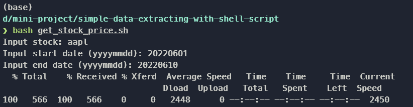

# Simple Data Extracting with SHELL Script
The purpose of the project is to learn how to write SHELL Script to download data from Website.

## What are we going to do
We're going to download stock price in CSV format from Yahoo Finance using SHELL Script. 

## Link data source
https://finance.yahoo.com/quote/AAPL/history?p=AAPL

## How to do this
**Step 1:** Simply clone this repository
```
git clone 
```
**Step 2:** Get inside the project
```
cd simple-data-extracting-with-shell-script
```
**Step 3:** Run the script  
```
bash get_stock_price.sh
```
**Step 4:** Input stock symbol and date range as you want  
Ex.
  

**Step 5:** Check you result in data folder  

All DONE!!!